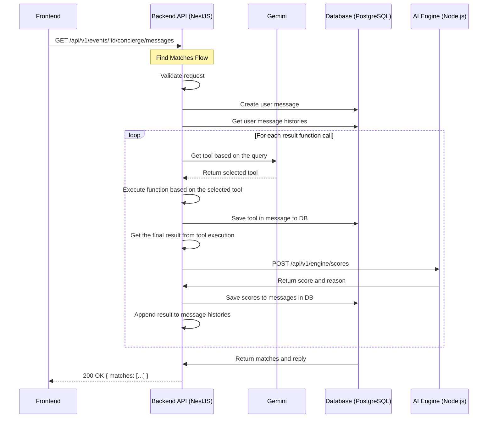

# Sequence Diagram

# Usage of AI (Gemini, ChatGPT, Perplexity)
- Suggest best folder structure
- Suggest the tech stack such as ORM, pgvector
- Fix lint
- Debugging
- Fix any error flow
- Suggest best code flow
- Help me with test
- Help create migrations
- Optimize prompts
